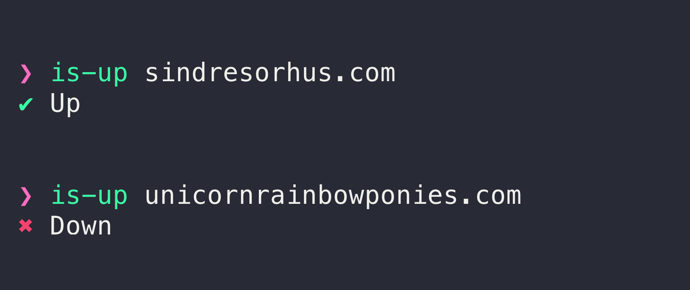

# is-up-cli

> Check whether a website is up or down using the [isitup.org](https://isitup.org) API



## Install

### Manually

```sh
npm install --global is-up-cli
```

### With Docker
```bash
docker build -t is-up-cli .

```

## Usage

### Manually
```
$ is-up --help

  Example
    $ is-up sindresorhus.com
    ✔ Up

  Exits with code 0 if up and 2 if down

```

### With Docker

```bash
docker run is-up-cli sindresorhus.com

```


## Related

- [is-up](https://github.com/sindresorhus/is-up) - API for this module
